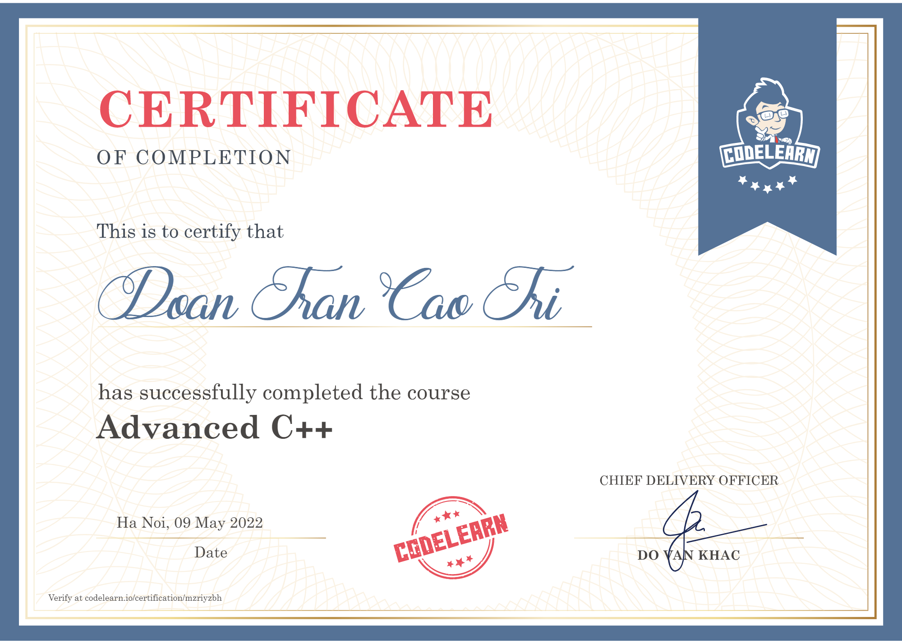
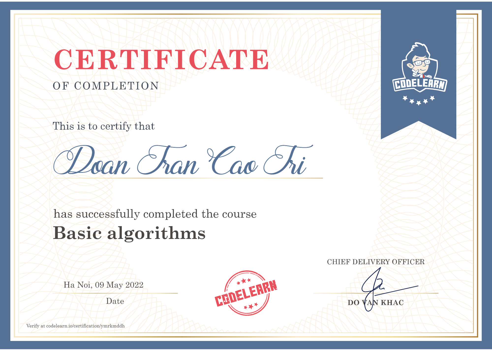
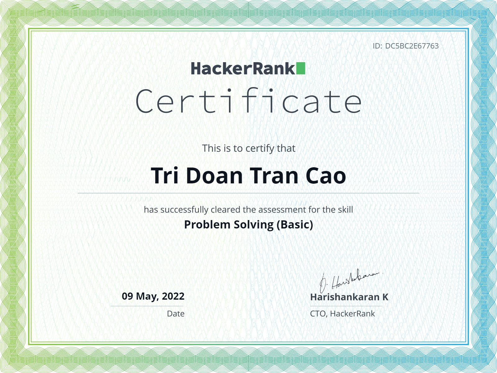

# My-Curriculum-Vitae

**Fundamental information** 
Name: Doan Tran Cao Tri 
Born: 11/08/2002 
Location: Ho Chi Minh City 
Country: Viet Nam 
Study at: Ho Chi Minh City University of Technology (HCMUT) 
Faculty: Computer Science 

**Achievements** 
TOP 40 Talented engineers at Ho Chi Minh City University of Technology year 2021 

**English Skill** 
IELTS: 5.0 

**Coding** 
Codeforce: https://codeforces.com/profile/tridoan288 
AtCoder: https://atcoder.jp/users/tridoan288 
LeetCode: https://leetcode.com/doantrancaotri1108/ 

**Project** 

**Contact** 
Phone number: (+84)961094102 
Facebook: https://www.facebook.com/profile.php?id=100013449046092 

**General education** 
Au Duong Lan primary school 
Le Ngoc Han junior high school 
Chuyen Tien Giang high school 
Ho Chi Minh City University of Technology 

**Certification**

https://www.hackerrank.com/certificates/dc5bc2e67763

https://www.hackerrank.com/certificates/3677458d17ac

